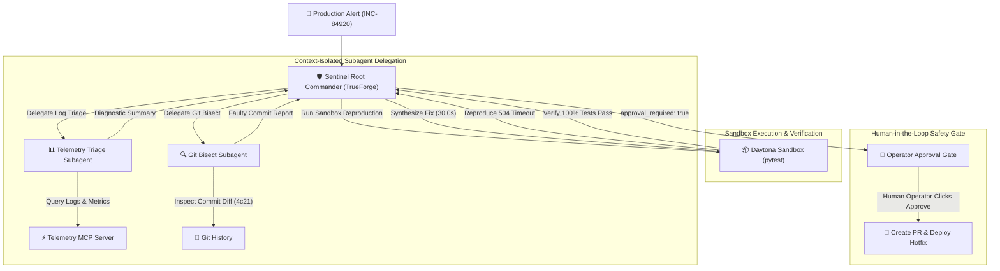

# SentinelForge: Autonomous SRE Incident Triage & Remediation Agent

An autonomous Site Reliability Engineering (SRE) agent system built on the **TrueForge Agent Harness**. SentinelForge investigates production alerts, isolates root causes across telemetry streams and Git histories using delegated subagents, synthesizes minimal code patches inside isolated Daytona sandboxes, and halts at human-in-the-loop approval gates before opening pull requests or deploying hotfixes.

---

## Architecture Overview

SentinelForge uses progressive disclosure to keep LLM context windows lean and deterministic. When high-volume telemetry is retrieved, large payloads are offloaded to sandbox storage, while specialized subagents isolate error signatures and commit regressions independently.



---

## Key Capabilities

* **TrueForge Agent Harness Native:** Implements multi-agent orchestration manifests (`agents/sentinel_root.json`, `agents/telemetry_triage.json`, `agents/git_bisect.json`) with configurable model providers (Google Gemini 2.0 Flash with local Ollama fallback support).
* **Model Context Protocol (MCP) Integration:** Exposes structured operational tools (`get_active_alerts`, `fetch_service_logs`, `get_metric_timeseries`) via TypeScript MCP server with dual HTTP backend and deterministic file-fixture modes.
* **Progressive Disclosure Skills:** Uses standardized agent skills (`skills/incident-triage/SKILL.md`, `skills/hotfix-generator/SKILL.md`, `.agents/skills/qodo-pr-resolver/SKILL.md`) for systematic triage and patch generation.
* **Deterministic Sandbox Testing:** Validates regressions and synthesizes fixes inside isolated execution environments running `pytest`.
* **Human-in-the-Loop Approval:** Destructive actions (`create_pull_request`, `deploy_hotfix`, `post_slack_update`) require human operator approval in the TrueForge interface before execution.

---

## Repository Structure

```
sentinelforge/
├── agents/                       # TrueForge agent specifications
│   ├── sentinel_root.json        # Root incident commander with approval gates
│   ├── telemetry_triage.json     # Subagent for log and metric correlation
│   └── git_bisect.json           # Subagent for commit diff regression analysis
├── skills/                       # Custom Agent Skills (Playbooks)
│   ├── incident-triage/          # Progressive disclosure triage runbook
│   │   └── SKILL.md
│   └── hotfix-generator/         # Sandbox reproduction and patch synthesis runbook
│       └── SKILL.md
├── .agents/skills/               # Qodo agent skills
│   ├── qodo-pr-resolver/         # Automated PR feedback resolution skill
│   └── qodo-get-rules/           # Semantic rule lookup skill
├── mcp-servers/                  # Model Context Protocol servers
│   └── telemetry-mcp/            # Real-time alert, log, and metric MCP server
│       ├── src/
│       │   ├── index.ts          # Server entrypoint and tool schemas
│       │   ├── providers.ts      # HTTP and File-fixture telemetry providers
│       │   ├── test-client.ts    # End-to-end integration test suite
│       │   └── test-edge-cases.ts# Window boundary and epoch alignment tests
│       └── package.json
├── mock-infra/                   # Target microservice and regression tests
│   ├── src/
│   │   ├── payment_service.py    # Simulated payment API with 504 regression
│   │   └── test_payment.py       # Pytest regression suite
│   ├── incident_payloads/        # Sample P1 incident telemetry payloads
│   └── README.md
├── scripts/                      # Verification and validation scripts
│   └── verify_agent_specs.js     # Agent manifest and skill validator
├── package.json                  # Root npm workspace manifest
├── pyproject.toml                # Python tool and path configuration
└── requirements.txt              # Python test dependencies (pytest>=8.0.0)
```

---

## Quickstart & Setup

### Prerequisites
* **Node.js:** `>= 22.14.0`
* **Python:** `>= 3.10`
* **Git:** Installed and configured

### 1. Install Dependencies
```bash
# Install root Node dependencies
npm install

# Install telemetry-mcp dependencies
cd mcp-servers/telemetry-mcp && npm install && cd ../..

# Install Python test dependencies
python -m pip install -r requirements.txt
```

### 2. Build the Project
```bash
npm run build
```

### 3. Run Automated Tests
```bash
# Validate agent manifests, subagents, skills, and approval gates
npm test

# Run target service regression test suite
npm run test:infra

# Run MCP integration and edge-case suites
cd mcp-servers/telemetry-mcp && npm test && cd ../..
```

### 4. Launch TrueForge Agent Harness
```bash
npm run harness:start
```
The TrueForge dashboard will open at `http://localhost:8790`.

---

## Qodo Code Review Evidence

Every feature branch and modification in this repository was reviewed by **Qodo**. Direct pushes to `main` were disallowed, and all findings were resolved and verified prior to merging.

### Pull Request Audit Trail

| PR # | Branch | Title | Qodo Findings Summary | Remediation & Commits | Review Status |
|---|---|---|---|---|---|
| **[#1](https://github.com/navraj-singh-dev/sentinelforge/pull/1)** | `feat/mock-target-service` | Mock Target Infrastructure & Timeout Regression Test | 1. Reproduction path mismatch in docs<br>2. Missing `pytest` in `requirements.txt`<br>3. Zero-duration timeout simulation<br>4. Missing Python 3.10+ requirement | Fixed in [`2006602`](https://github.com/navraj-singh-dev/sentinelforge/commit/2006602) and [`2433041`](https://github.com/navraj-singh-dev/sentinelforge/commit/2433041). Added dependency manifests, standardized root execution paths, and enforced `@dataclass(slots=True)` version constraints. | `✓ Resolved`<br>(Merged to `main`) |
| **[#2](https://github.com/navraj-singh-dev/sentinelforge/pull/2)** | `feat/telemetry-mcp` | Telemetry MCP Server (Alerts, Logs & Metrics) | 1. Fabricated telemetry mixed with transport<br>2. Fixed 15s log window spacing overflow<br>3. Unbounded lookback schema<br>4. Negative window metric math inversion<br>5. Hardcoded deployment boundary index<br>6. Missing test assertions in test script | Fixed in [`e6cd333`](https://github.com/navraj-singh-dev/sentinelforge/commit/e6cd333) and [`64d40d9`](https://github.com/navraj-singh-dev/sentinelforge/commit/64d40d9). Decoupled `ITelemetryProvider`, added proportional window scaling, added strict Zod bounds `[1..1440]`, aligned degradation to absolute epoch timestamps, and wrote `test-client.ts` and `test-edge-cases.ts` with strict assertions. | `✓ Resolved`<br>(Merged to `main`) |
| **[#3](https://github.com/navraj-singh-dev/sentinelforge/pull/3)** | `feat/agent-specs-and-skills` | TrueForge Agent Specs, Custom Skills & Approval Gates | 1. Root `build` script calling missing `build:mcp`<br>2. Approval policy contradiction on `post_slack_update`<br>3. Multiline search query newlines in curl template<br>4. GitLab plain text comments missing discussion IDs<br>5. Bitbucket hardcoded API URL ignoring `BB_URL`<br>6. Gerrit raw markdown in JSON string<br>7. Azure repo regex retaining `.git` suffix<br>8. Environment variable precedence in script template | Fixed in [`b791d89`](https://github.com/navraj-singh-dev/sentinelforge/commit/b791d89). Restored `build:mcp`, enforced `approval_required: true` on `post_slack_update`, updated `verify_agent_specs.js` test suite, safely serialized JSON across skill templates, updated GitLab JSON note commands, enabled `${BB_URL}` support, and fixed Azure regex stripping. | `✓ Resolved`<br>(Merged to `main`) |
| **[#4](https://github.com/navraj-singh-dev/sentinelforge/pull/4)** | `feat/integration-and-docs` | Root Documentation & Qodo Code Review Evidence | 1. Node.js prerequisite version mismatch (`>=20.0.0` vs `>=22.14.0`) | Fixed in [`592a169`](https://github.com/navraj-singh-dev/sentinelforge/commit/592a169). Aligned README Node.js engine requirement to `>=22.14.0` per package manifest. | `✓ Resolved`<br>(Merged to `main`) |

---

## License

This project is licensed under the MIT License — see the [LICENSE](LICENSE) file for details.
